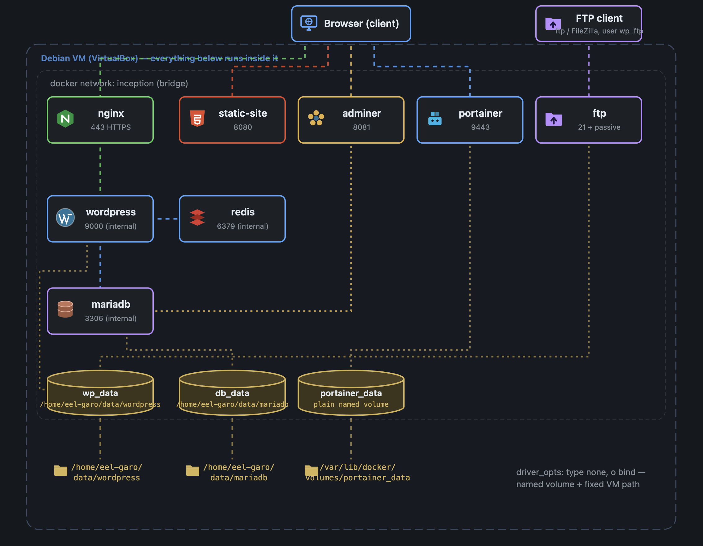

*This project has been created as part of the 42 curriculum by [eel-garo](https://github.com/MEHDIJAD).*



For the full breakdown of my journey on this project, read this: [Notion page](https://app.notion.com/p/Inception-32b43e92de4080c48be2e1441544f187?source=copy_link)

# Inception

## Description (42 Project)

Inception is a system administration project from the 42 curriculum. The goal
is to set up a small, self-hosted infrastructure using **Docker** and
**Docker Compose**, where every service runs in its own container built
**from scratch** (no pre-built DockerHub images for the core services, no
`latest` tags).

The stack deploys a WordPress website served over HTTPS, backed by a MariaDB
database, all wired together through a dedicated Docker network:

- **NGINX** — the only entrypoint into the infrastructure. Terminates TLS
  (TLSv1.2/1.3 only, self-signed certificate) and forwards PHP requests to
  WordPress. Port 443 is the only port exposed to the host.
- **WordPress + php-fpm** — runs the WordPress core over PHP-FPM (no
  built-in web server: NGINX does that job). On first boot it downloads and
  configures WordPress via `wp-cli`, creates the admin account (with a
  non-generic username, per project constraints) and a second regular user.
- **MariaDB** — the database container. Initializes the WordPress database,
  user, and passwords on first boot and persists data across restarts.

Everything is orchestrated with a single `docker-compose.yml`, driven by a
`Makefile`, so the whole stack comes up (or gets torn down) with one command.

## Instructions

### Requirements
- Docker and Docker Compose
- `make`
- A **virtual machine** running Linux — the subject requires the stack to
  be deployed inside a VM (not directly on the host), so that persistence
  can be verified by rebooting the VM itself and relaunching the stack

### Setup
1. Clone the repository.
2. Fill in the environment variables in `system/srcs/.env` (domain name,
   database name/user, WordPress admin/user info).
3. Fill in the secret files under `system/secrets/` (`db_password.txt`,
   `db_root_password.txt`, `credentials.txt`). These are **not** committed
   with real values — only placeholders/examples.
4. Add a line to your host's `/etc/hosts` mapping your chosen domain
   (e.g. `login.42.fr`) to `127.0.0.1`, so the browser resolves it locally.

### Build & run
From the root directory:

```bash
make up      # builds every image and starts the stack in detached mode
make down    # stops and removes the containers
make clean   # down + prune unused Docker resources (dangling images, cache)
make fclean  # clean + remove the named volumes (wipes DB and WP data)
make re      # fclean + up, i.e. a full rebuild from scratch
```

Once `make up` finishes, visit `https://<your-domain>` in a browser (accept
the self-signed certificate warning) to reach the WordPress site.

## Project description: Docker & sources

**Why Docker here.** Each service (NGINX, WordPress/php-fpm, MariaDB) is
built from a minimal `debian:bookworm-slim` base with only the packages it
needs, then wired together with a user-defined bridge network
(`inception`) and named local volumes bind-mounted to the host
(`~/data/wordpress`, `~/data/mariadb`). This keeps every service isolated,
reproducible from its Dockerfile, and independently restartable —
containers are meant to be disposable, the data on the volumes is not.

**Sources included:**
- `srcs/docker-compose.yml` — defines the network, volumes, secrets, and the
  three services.
- `srcs/requirements/<service>/Dockerfile` — one per service, each installing
  only what that service needs.
- `srcs/requirements/<service>/conf/` — service configuration (NGINX vhost
  and TLS settings, PHP-FPM pool config, MariaDB server config).
- `srcs/requirements/<service>/tools/entrypoint.sh` — first-boot logic per
  container (e.g. WordPress waits for MariaDB to be reachable before running
  `wp-cli`, MariaDB initializes its database/users on first run).
- `secrets/` — files holding sensitive values, referenced by Docker secrets
  in the compose file rather than passed as plain environment variables.

### Virtual Machines vs Docker
A VM virtualizes an entire machine — its own kernel, drivers, and OS — which
makes it heavier to boot and more resource-hungry, but fully isolated.
A Docker container shares the host's kernel and only packages the
application and its dependencies, so it starts in seconds and uses far less
memory/disk. The trade-off is a thinner isolation boundary: containers
depend on the host kernel's namespaces/cgroups for separation rather than a
full hardware virtualization layer. For this project, Docker is the right
tool because each service just needs its own filesystem and process space,
not a whole separate operating system.

### Secrets vs Environment Variables
Environment variables (`.env`, `env_file`) are convenient but end up
visible in `docker inspect`, in the container's process environment, and
potentially in logs — not ideal for passwords. Docker **secrets** are
mounted as read-only files inside the container (under `/run/secrets/`) and
are not exposed through `docker inspect` or the environment, which is safer
for credentials. In this project, non-sensitive configuration
(domain name, usernames, database name) goes through `.env`, while actual
passwords (`db_password`, `db_root_password`, WordPress `credentials`) are
passed as Docker secrets and read from `/run/secrets/...` inside the
entrypoint scripts.

### Docker Network vs Host Network

**Host network** (`network_mode: host`) gives a container no network
isolation at all — it shares the host's network stack directly, so a port
bound inside the container is bound on the host itself.
 
**Docker (bridge) network** — the user-defined `inception` network used
here — gives every container its own private IP, plus built-in DNS so
containers can reach each other **by name** instead of by IP. Only ports
explicitly published (`ports:`) become reachable from outside it.
 
This is why WordPress connects to `mariadb:3306` with no IP configuration
at all, and why only NGINX publishes a port (443): MariaDB only needs to
be reachable by other containers on the network, not by the host. Host
mode would erase that boundary — every service would sit exposed on the
host's own network with no name-based resolution.

### Docker Volumes vs Bind Mounts
Both persist data outside a container's writable layer, but differently.
A **bind mount** points directly at an arbitrary path on the host
filesystem, chosen by whoever writes the compose file. A **Docker volume**
is managed by Docker itself, stored under Docker's own data directory, and
referenced by name rather than a host path — Docker handles its lifecycle.
This project actually uses volumes configured with the `local` driver and
`o: bind` driver options, which is a middle ground: it's declared as a
named volume (`wp_data`, `db_data`) so Docker manages it like a volume, but
under the hood it's bind-mounted to a fixed, predictable host path
(`/home/<login>/data/...`), which the subject requires so the data is easy
to locate and inspect outside of Docker.

## Resources

- [Docker documentation](https://docs.docker.com/)
- [Docker Compose file reference](https://docs.docker.com/compose/compose-file/)
- [Docker secrets](https://docs.docker.com/engine/swarm/secrets/)
- [NGINX documentation](https://nginx.org/en/docs/)
- [WP-CLI documentation](https://wp-cli.org/)
- [MariaDB documentation](https://mariadb.com/kb/en/documentation/)

### AI usage
AI helped draft and format the project's three documentation files —
`README.md`, `USER_DOC.md`, and `DEV_DOC.md` — mainly for structure and
correct Markdown syntax. Separately, I fed my own notes and research into
NotebookLM to get a deeper walkthrough of Docker internals and container
orchestration practices, and leaned on a "teach me, don't just answer"
approach (a habit picked up from AI Hero's content) so I'd actually
understand the setup instead of pasting a config that happens to work.
